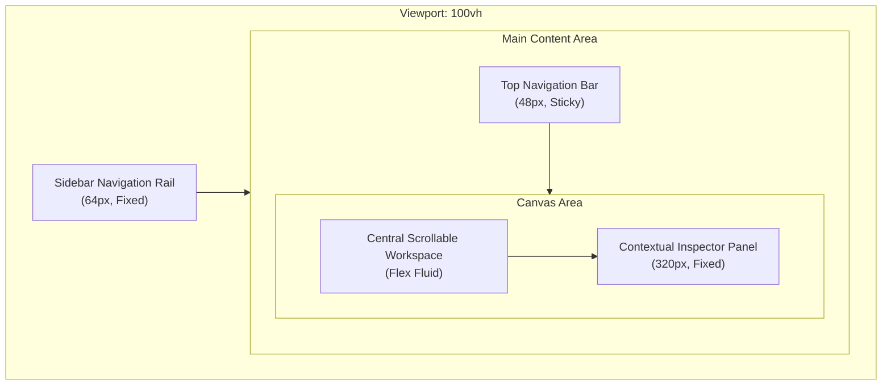
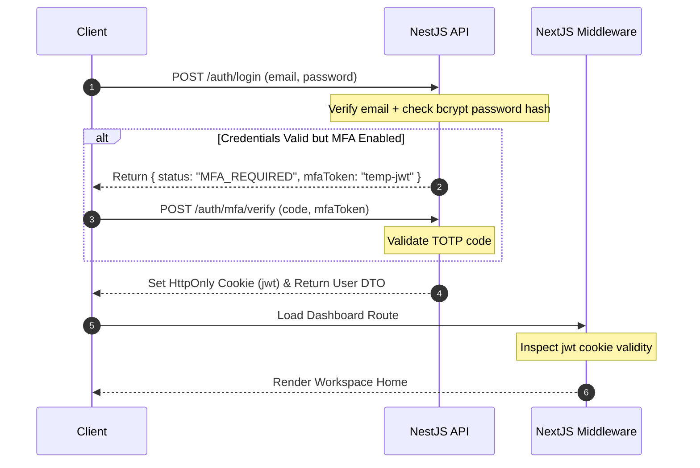
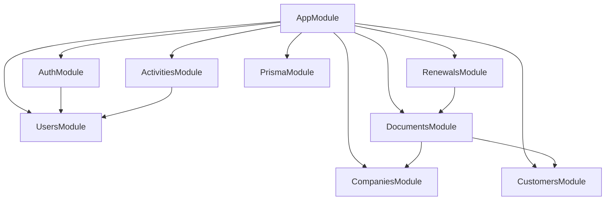

# DocFlow Workspace Studio Architecture Blueprint

> [!NOTE]
> I'm using the `writing-plans` skill to create the implementation plan. This blueprint serves as the single source of truth for the Next.js, NestJS, Prisma, MySQL, and Tailwind CSS v4 monorepo foundation. Do not implement business features until this foundation is approved.

---

## 1. Design Aesthetics & Layout Analysis

The Stitch design system for **DocFlow Workspace Studio** centers on a **Utility-Minimalism** aesthetic. It prioritizes document space and data density by replacing heavy shadows with tonal layering and crisp 1px borders.

### The 3-Pane Workspace Layout


*   **Pane 1 (Navigation Rail):** 64px wide, fixed on the left. Holds the brand logo container and navigation icon buttons (Home, Documents, Workflow, Reports, Archive, Settings, Profile).
*   **Pane 2 (Central Workspace):** Fluid layout scrolling vertically with 24px margins. Content is wrapped in a max-width container (`max-w-5xl` or `max-w-6xl` depending on data density).
*   **Pane 3 (Contextual Inspector):** 320px wide, fixed on the right. Contains route-specific metadata, action lists ("Next Steps", "Block Properties"), list items, and quick action shortcuts.

---

## 2. Monorepo Folder Structure

We will adopt a clean, scale-ready monorepo structure using `pnpm` workspaces (or `npm` workspaces) to cleanly separate the Frontend (Next.js 15) and Backend (NestJS), sharing the database schema (Prisma + MySQL).

```text
docflow-workspace-studio/
├── apps/
│   ├── web/                     # Next.js 15 (App Router, React 19, Tailwind CSS v4)
│   │   ├── src/
│   │   │   ├── app/             # App Router pages
│   │   │   ├── components/      # Route-specific or shared components
│   │   │   │   ├── ui/          # Radix/shadcn components (styled via Tailwind v4)
│   │   │   │   └── shared/      # Common layout wrappers (MainLayout, Sidebar, Inspector)
│   │   │   ├── hooks/           # Client hooks (useAuth, useCommandPalette)
│   │   │   ├── lib/             # API client, utility functions
│   │   │   └── styles/
│   │   │       └── globals.css  # Tailwind v4 imports and theme overrides
│   │   ├── package.json
│   │   └── tsconfig.json
│   │
│   └── api/                     # NestJS 11 backend module structure
│       ├── src/
│       │   ├── app.module.ts
│       │   ├── main.ts
│       │   ├── modules/
│       │   │   ├── auth/        # JWT & Session auth, password hashing
│       │   │   ├── users/       # Profiles, roles, settings
│       │   │   ├── companies/   # Legal entities, banking info, addresses
│       │   │   ├── customers/   # Clients, contact lists
│       │   │   ├── documents/   # Document logs, PDFs, editor block state
│       │   │   ├── renewals/    # Spreadsheet renewal alerts
│       │   │   └── activities/  # Audit history logger
│       │   └── prisma/
│       │       └── prisma.service.ts # Prisma service adapter
│       ├── package.json
│       └── tsconfig.json
│
├── packages/
│   ├── db/                      # Shared DB configuration
│   │   ├── prisma/
│   │   │   ├── schema.prisma    # Single source of truth for MySQL database
│   │   │   └── seed.ts          # Database seed scripts matching Stitch designs
│   │   ├── package.json
│   │   └── tsconfig.json
│   └── shared-types/            # Shared TypeScript DTOs and interfaces
│       ├── index.ts
│       └── package.json
│
├── docker-compose.yml           # Runs local MySQL DB and NestJS development container
├── package.json                 # Monorepo workspaces definition
└── pnpm-workspace.yaml          # Monorepo configuration
```

---

## 3. Design Tokens & Styling (Tailwind v4)

Tailwind v4 replaces the legacy `tailwind.config.js` with direct CSS `@theme` injections. Below is our design token configuration mapped exactly from the Stitch fidelity model, to be placed inside `apps/web/src/styles/globals.css`.

```css
@import "tailwindcss";

@plugin "@tailwindcss/forms";
@plugin "@tailwindcss/container-queries";

@theme {
  /* Color Palette (Paper & Ink philosophy) */
  --color-background: #f8f9fa;
  --color-on-background: #191c1d;
  
  --color-primary: #3525cd;
  --color-primary-container: #4f46e5;
  --color-on-primary: #ffffff;
  --color-on-primary-container: #dad7ff;
  --color-primary-fixed-variant: #3323cc;
  
  --color-secondary: #575e70;
  --color-secondary-container: #d9dff5;
  --color-on-secondary: #ffffff;
  --color-on-secondary-container: #5c6274;
  
  --color-tertiary: #7e3000;
  --color-tertiary-container: #a44100;
  --color-on-tertiary: #ffffff;
  --color-on-tertiary-container: #ffd2be;
  
  --color-error: #ba1a1a;
  --color-error-container: #ffdad6;
  --color-on-error: #ffffff;
  --color-on-error-container: #93000a;
  
  --color-outline: #777587;
  --color-outline-variant: #c7c4d8;
  
  --color-surface: #f8f9fa;
  --color-surface-dim: #d9dadb;
  --color-surface-bright: #f8f9fa;
  --color-surface-container-lowest: #ffffff;
  --color-surface-container-low: #f3f4f5;
  --color-surface-container: #edeeef;
  --color-surface-container-high: #e7e8e9;
  --color-surface-container-highest: #e1e3e4;
  --color-on-surface: #191c1d;
  --color-on-surface-variant: #464555;
  
  --color-inverse-surface: #2e3132;
  --color-inverse-on-surface: #f0f1f2;

  /* Border Radii */
  --radius-sm: 4px;
  --radius-md: 8px;      /* Standard Button, Input, small Card */
  --radius-lg: 12px;     /* Medium Containers */
  --radius-xl: 16px;     /* Modals, Large Canvas items */
  --radius-full: 9999px; /* Status tags, pills */

  /* Spacing Grid (8px baseline) */
  --spacing-nav-rail-width: 64px;
  --spacing-inspector-width: 320px;
  --spacing-gutter: 16px;
  --spacing-margin-page: 24px;
  --spacing-stack-xs: 4px;
  --spacing-stack-sm: 8px;
  --spacing-stack-md: 16px;
  --spacing-stack-lg: 24px;

  /* Typography Rules (Inter Font Stack) */
  --font-sans: "Inter", sans-serif;
  --font-display-sm: "Inter", sans-serif;
  --font-headline-lg: "Inter", sans-serif;
  --font-headline-md: "Inter", sans-serif;
  --font-headline-sm: "Inter", sans-serif;
  
  --font-size-display-sm: 30px;
  --font-size-headline-lg: 24px;
  --font-size-headline-md: 20px;
  --font-size-headline-sm: 16px;
  --font-size-body-lg: 16px;
  --font-size-body-md: 14px;
  --font-size-body-sm: 13px;
  --font-size-label-md: 12px;
  --font-size-label-sm: 11px;
}
```

---

## 4. Routing Blueprint

| Route | UI Screen Source | Layout Structure | Key Dynamic Interactions |
| :--- | :--- | :--- | :--- |
| `/` | `Workspace Home` | 3-Pane (Rail + TopBar + Canvas + Inspector) | Bento Metrics, Recent table links, Activity items, Attention Cards, Shortcuts. |
| `/companies` | `Company Master` | 3-Pane (Rail + TopBar + Canvas + Inspector) | List of companies, Add entity drawer, edit modal, dynamic address/banking tabs. |
| `/customers` | `Customer Workspace` | 3-Pane (Rail + TopBar + Canvas + Inspector) | Master-Detail pane with customer records list, recent logs, active proposal/invoice table. |
| `/documents/[id]` | `Document History` | 3-Pane (Rail + TopBar + Canvas + Inspector) | Detailed history logs, export CSV trigger, full audit trail list, properties side-panel. |
| `/invoices/[id]/edit`| `Invoice Designer` | 3-Pane (Rail + TopBar + Document Editor + Inspector) | Live editor pane, line-items table calculations, note toggles, export sidebar. |
| `/proposals/[id]/edit`| `Proposal Builder` | 3-Pane (Rail + TopBar + Document Editor + Inspector) | Block insertion (cover, summaries), block drag action, block settings inspector. |
| `/renewals` | `Renewal Spreadsheet` | 3-Pane (Rail + TopBar + Full Spreadsheet) | Data grid with Excel-like cells, column filter overlays, export functionality. |
| `/templates` | `Template Designer` | 3-Pane (Rail + TopBar + Grid + Inspector) | Tab categories (Invoices, Proposals, Contracts), preview drawer, default template selector. |
| `/settings` | `Settings Workspace` | 3-Pane (Rail + TopBar + Config Form) | Navigation tabs, MFA toggle, auto-archive inputs, retention sliders. |
| *Global Command* | `Global Search` | Overlay Dialog / Modal Backdrop | Triggered via `Ctrl + K` search input. Instant filter lists for navigation and docs. |

---

## 5. Shared Component Architecture

To prevent duplication and enforce visual fidelity, we categorize UI elements into a strict, reusable structure:

### Layout components
*   `MainLayout`: Root wrapper component layout. Connects sidebar, header, central body, and side panels.
*   `SidebarRail`: Standardized left-side nav-bar. Displays the logo, menu links (active styling utilizes a `before:w-[3px]` indigo bar and solid-colored icons), and account indicators.
*   `TopHeader`: Renders workspace search bar, quick action button ("New Document"), and notifications panel. Contains dynamic offsets dynamically responsive to inspector visibility.
*   `ContextualInspector`: Fixed-aside wrapper handling open/close transitions, dynamic sidebar headers, and specific metadata widgets.

### Base UI Atoms (using Radix Primitive + Tailwind v4 style rules)
*   `Button`: High-fidelity implementation of the primary, secondary, outline, and destructive button themes specified in Stitch specs.
*   `Input`: Bordered inputs with high density sizing, styling the focus outline halo precisely.
*   `Badge`: Colored tag wrappers (Indigo-50, Tertiary-container, Error-container).
*   `DataTable`: Standardized data grid matching table spacing specs (e.g. 40px base row height, hover background changes, etc.).

---

## 6. Authentication Foundation

*   **Mechanism:** Session-based authentication with secure HttpOnly, SameSite cookies or JSON Web Tokens (JWT) stored securely.
*   **MFA Flow:** Time-Based One-Time Password (TOTP) supported via `speakeasy` (on backend) and QR-code generation (`qrcode` package).
*   **Route Guards:** Next.js middleware checking session tokens before loading pages, redirecting unauthenticated users to `/login`. NestJS JWT Auth Guards verifying requests to `/api/*` endpoints.



---

## 7. NestJS API Modules



*   **PrismaModule:** Exports the PrismaService globally for database access.
*   **AuthModule:** Exposes controllers and services for standard login, TOTP registration, token signing, and session management.
*   **UsersModule:** Custom services checking roles and updating user metadata.
*   **CompaniesModule:** Entities representing workspace company accounts, registry parameters, address info, and banking configurations.
*   **CustomersModule:** Directory endpoints mapping consumer contacts.
*   **DocumentsModule:** Core files system storage metadata and structured document block data (representing sections of proposals or line-items of invoices).
*   **RenewalsModule:** Automated triggers tracking contract end dates and sending alerts.
*   **ActivitiesModule:** Unified auditing module receiving logging calls across all operations.

---

## 8. Prisma Database Schema

Below is the database schema (`packages/db/prisma/schema.prisma`) mapping all structural properties needed by the Stitch interface.

```prisma
datasource db {
  provider = "mysql"
  url      = env("DATABASE_URL")
}

generator client {
  provider = "prisma-client-js"
}

enum UserRole {
  ADMIN
  MANAGER
  USER
  AUDITOR
}

enum DocumentType {
  PDF
  DOCX
  ZIP
  PROPOSAL
  INVOICE
  SPREADSHEET
}

enum DocumentStatus {
  DRAFT
  REVIEW
  COMPLETED
  ARCHIVED
}

enum ActivityType {
  EDIT
  COMMENT
  APPROVE
  REJECT
  SYSTEM
}

enum RenewalType {
  SOFTWARE
  LEASE
  INSURANCE
  CONTRACT
}

model User {
  id           String     @id @default(uuid())
  email        String     @unique
  passwordHash String
  firstName    String
  lastName     String
  role         UserRole   @default(USER)
  mfaEnabled   Boolean    @default(false)
  mfaSecret    String?
  createdAt    DateTime   @default(now())
  updatedAt    DateTime   @updatedAt
  documents    Document[] @relation("DocumentAuthor")
  activities   Activity[]
  comments     Comment[]

  @@map("users")
}

model Company {
  id                 String     @id @default(uuid())
  name               String
  registrationNumber String?
  taxId              String?
  addressLine1       String
  addressLine2       String?
  city               String
  postalCode         String
  country            String
  bankName           String?
  bankIban           String?
  bankBic            String?
  createdAt          DateTime   @default(now())
  updatedAt          DateTime   @updatedAt
  documents          Document[]
  customers          Customer[]

  @@map("companies")
}

model Customer {
  id           String     @id @default(uuid())
  companyId    String
  company      Company    @relation(fields: [companyId], references: [id], onDelete: Cascade)
  name         String
  email        String
  phone        String?
  addressLine1 String?
  addressLine2 String?
  city         String?
  postalCode   String?
  country      String?
  status       String     @default("ACTIVE") // ACTIVE, INACTIVE
  createdAt    DateTime   @default(now())
  updatedAt    DateTime   @updatedAt
  documents    Document[]

  @@map("customers")
}

model Document {
  id         String         @id @default(uuid())
  title      String
  type       DocumentType
  status     DocumentStatus @default(DRAFT)
  fileUrl    String?
  companyId  String?
  company    Company?       @relation(fields: [companyId], references: [id], onDelete: SetNull)
  customerId String?
  customer   Customer?      @relation(fields: [customerId], references: [id], onDelete: SetNull)
  authorId   String
  author     User           @relation("DocumentAuthor", fields: [authorId], references: [id])
  createdAt  DateTime       @default(now())
  updatedAt  DateTime       @updatedAt
  blocks     DocumentBlock[]
  activities Activity[]
  comments   Comment[]
  renewals   Renewal[]

  @@map("documents")
}

model DocumentBlock {
  id         String   @id @default(uuid())
  documentId String
  document   Document @relation(fields: [documentId], references: [id], onDelete: Cascade)
  sortOrder  Int      @default(0)
  blockType  String   // e.g., "COVER", "TEXT", "TABLE", "NOTES"
  content    String   @db.Text // JSON string representing properties specific to this block
  createdAt  DateTime @default(now())
  updatedAt  DateTime @updatedAt

  @@map("document_blocks")
}

model Activity {
  id         String       @id @default(uuid())
  userId     String
  user       User         @relation(fields: [userId], references: [id], onDelete: Cascade)
  actionType ActivityType
  documentId String?
  document   Document?    @relation(fields: [documentId], references: [id], onDelete: Cascade)
  details    String       @db.VarChar(1000)
  createdAt  DateTime     @default(now())

  @@map("activities")
}

model Renewal {
  id          String      @id @default(uuid())
  documentId  String?
  document    Document?   @relation(fields: [documentId], references: [id], onDelete: SetNull)
  itemName    String
  renewalType RenewalType
  renewalDate DateTime
  amount      Decimal     @db.Decimal(10, 2)
  status      String      @default("PENDING") // PENDING, COMPLETED
  createdAt   DateTime    @default(now())
  updatedAt   DateTime    @updatedAt

  @@map("renewals")
}

model Comment {
  id         String   @id @default(uuid())
  documentId String
  document   Document @relation(fields: [documentId], references: [id], onDelete: Cascade)
  userId     String
  user       User     @relation(fields: [userId], references: [id], onDelete: Cascade)
  text       String   @db.VarChar(1000)
  createdAt  DateTime @default(now())
  updatedAt  DateTime @updatedAt

  @@map("comments")
}
```

---

## 9. Implementation Roadmap

### Phase 1: Environment & Project Foundation

- [ ] **Task 1: Monorepo & Workspaces Setup**
  - **Files:** Create root `package.json`, `pnpm-workspace.yaml`, and baseline tsconfig settings.
  - **Action:** Initialize directory, workspace dependencies, and git settings. Verify workspaces configurations.

- [ ] **Task 2: Shared Database Core**
  - **Files:** Create `packages/db/package.json`, `packages/db/prisma/schema.prisma` (pasted above).
  - **Action:** Initialize prisma module, configure MySQL connections, and write basic seed parameters replicating Stitch datasets (e.g. Acme Corp, Sarah J., Mike T., Globex Inc.).

- [ ] **Task 3: NestJS Backend API Skeleton**
  - **Files:** Initialize NestJS in `apps/api/`. Install core framework, config schema validations, and prisma services.
  - **Action:** Build `AppModule`, `PrismaModule`, and skeleton module routers for Auth, Users, Companies, Customers, Documents, Renewals, and Activities. Ensure compilation is error-free.

- [ ] **Task 4: Next.js Frontend Framework Core**
  - **Files:** Initialize Next.js 15 inside `apps/web/`. Install React 19, tailwindcss v4 plugins.
  - **Action:** Set up `apps/web/src/styles/globals.css` with the design tokens. Confirm tailwind v4 compiles without errors.

- [ ] **Task 5: Authentication Foundation & Middleware**
  - **Files:** Build security services on API, configure JWT strategies, hash scripts. Write next.js cookies session checking middleware.
  - **Action:** Create basic auth routes (`/auth/login`, `/auth/verify`). Guard default paths redirecting unregistered requests to `/login`.

---

## 10. Verification Choice

Plan complete and saved to `C:\Users\bhupe\.gemini\antigravity-cli\brain\0a7c775c-0623-44dd-bcd7-21bee1141d9d\architecture_blueprint.md`.

Please review this foundation plan and specify your execution choice:
1. **Subagent-Driven (recommended)** - I dispatch specialized subagents to construct each setup step, validating builds incrementally.
2. **Inline Execution** - Run setup commands directly in this main developer thread using executing-plans.
